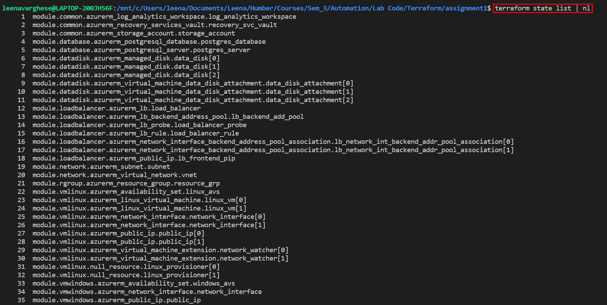

# ABOUT THIS PROJECT
This project is all about writing Infrastructure as a Code (IaaC) to deploy infrastructure in Azure cloud. I used modular configuration to seperate the code logically based on the resources. Here are the list of modules with its associated resources.

a. Module name (rgroup): One resource group. The module returns the name of the resource group to the root module.
b. Module name (network): One virtual network and one subnet. The module returns the names of the virtual network and subnet to the root  module.
c. Module name (common): One log analytics workspace, one recovery services vault, and one standard storage account with LRS redundancy(replication type). This storage account is different from that of the backend’s. The module returns the names of the three resources to the root module.
d. Module name (vmlinux): Two CentOS 8.2 Linux VMs with public IP addresses created in one availability set. Each VM to use the same storage account blob container that is created above for VM boot diagnostics. Each VM to have a unique DNS label assigned. The VMs to have Network Watcher extension installed. The module returns the hostnames, domain names, private IP addresses, and public IP addresses of the VMs to the root module.
e. Module name (vmwindows): One Windows Server 2016 VM with a public IP address created in another availability set. The VM to have Antimalware extension installed. The VM to use the same storage account blob container that is created above for VM boot diagnostics. The VM to have a unique DNS label assigned. The module returns the hostname, domain names, private IP address, and public IP address of the VM to the root module.
f. Module name (datadisk): Three 10 GB disks created and attached to each of the three VMs.
g. Module name (loadbalancer): One public-facing basic load balancer with both Linux VMs behind it. The module returns the name of the load balancer to the root module.
h. Module name (database): One Azure DB for PostgreSQL instance. The module returns the name of the DB instance to the root module. 

# TECHNOLOGY STACK 
    * Microsoft Azure
    * Terraform

# INSTALLATION
    * You'll need to have a Microsoft Azure account.
    *  - Folow this guide to install Terraform in your local environment.

# COMMANDS USED
Inside the root directory run the following commands,
    * terraform init
    * terraform apply

# LIST OF RESOURCES CREATED ON SUCCESSFUL RUN

